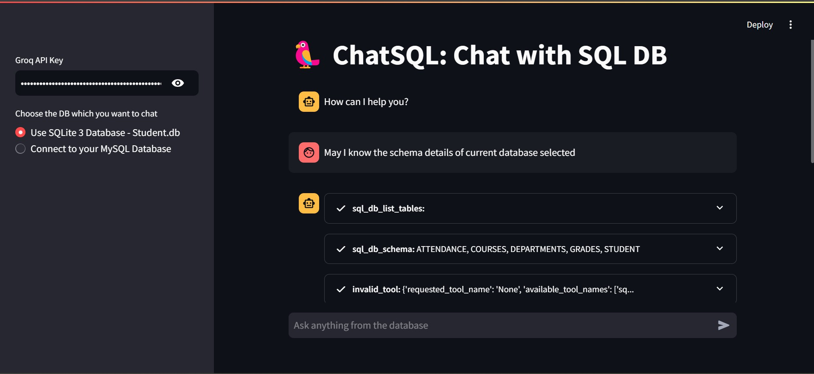

# LangChain SQL Database Chat Interface

[](https://www.python.org/)
[](https://langchain.io/)
[](https://streamlit.io/)
[](https://www.groq.com/)
[](https://www.sqlite.org/)
[](https://www.mysql.com/)

This project implements an interactive chat interface that allows users to query SQL databases (SQLite and MySQL) using natural language through a Streamlit web application powered by LangChain and Groq LLM.
## Launch Application
you can access the App through ([Launch Application](https://yunus5603-chatsql-app-4qqccv.streamlit.app/))


## 🌟 Features

- Natural language queries to SQL databases
- Support for both SQLite and MySQL databases
- Interactive Streamlit web interface
- Real-time streaming responses
- Sample student database with departments, courses, grades, and attendance data
- Secure API key and database credential management

## 🛠️ Prerequisites

- Python 3.8+
- Groq API key ([Get it here](https://console.groq.com))
- MySQL Server (optional, for MySQL database support)

## 📦 Installation

1. Clone the repository:
```bash
git clone <repository-url>
cd ChatSQL
```

2. Create and activate a virtual environment:
```bash
conda create -p venv python==3.12
conda activate vnev\
```


3. Install required packages:
```bash
pip install -r requirements.txt
```


## 🗄️ Database Setup

### SQLite Database
1. Run the database creation script:
```bash
python sqlite.py
```

This will:
- Create a new `student.db` file
- Set up tables for departments, courses, students, grades, and attendance
- Generate sample data

### MySQL Database (Optional)
1. Install MySQL Server
2. Create a new database
3. Note down your:
   - Host address
   - Username
   - Password
   - Database name

## 🚀 Running the Application

1. Start the Streamlit application:
```bash
streamlit run app.py
```

2. Access the web interface at `http://localhost:8501`

3. In the sidebar:
   - Choose your database type (SQLite or MySQL)
   - If using MySQL, enter your database credentials
   - Enter your Groq API key

## 💬 Using the Chat Interface

1. The chat interface accepts natural language queries about the database
2. Example queries:
   - "Show me all departments and their HODs"
   - "What is the average CGPA of students in the Computer Science department?"
   - "List all courses with more than 3 credits"
   - "Show me the grade distribution in Python Programming course"

## 📚 Database Schema

The database contains the following tables:

### Departments
- dept_id (Primary Key)
- dept_name
- hod_name
- budget

### Courses
- course_id (Primary Key)
- course_name
- dept_id (Foreign Key)
- credits
- semester

### Students
- student_id (Primary Key)
- name
- email
- dept_id (Foreign Key)
- enrollment_date
- cgpa

### Grades
- grade_id (Primary Key)
- student_id (Foreign Key)
- course_id (Foreign Key)
- grade
- semester
- academic_year

### Attendance
- attendance_id (Primary Key)
- student_id (Foreign Key)
- course_id (Foreign Key)
- date
- status

## 🔒 Security Notes

- Store sensitive information (API keys, database credentials) securely
- The SQLite database is opened in read-only mode
- Database credentials are handled through the Streamlit interface
- Use environment variables for production deployments

## 🤝 Contributing

Contributions are welcome! Please feel free to submit a Pull Request or open an issue to suggest improvements or report bugs.

---

## 📝 License

This project is licensed under the [MIT License](LICENSE).

---

## 👥 Contact

For any questions or feedback, please contact [syunus838@gmail.com].

